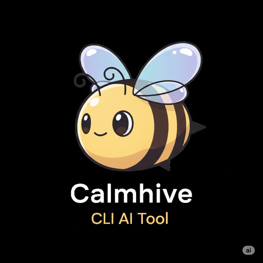

<div align="center">
  
  
  # 🐝 Calmhive v14.0.0 - Claude CLI That Works When Claude Doesn't

  ## lets bee friends 🐝

  > **The secret sauce: Intelligent background processing that recovers from Claude usage limits**  
  > Voice-activated automation with 95+ tools and adaptive retry logic.
</div>

✨ **What makes Calmhive special?**
- 🔄 **Smart retry in AFk mode** - Auto-recovers from Claude usage limits during background tasks
- 📅 **Natural Language Scheduling** - Say "daily at 9am" to schedule recurring tasks
- 🎙️ **Voice activated** - Just say "hey friend" to control Claude with your voice  
- 🏃 **Background processing** - Run long tasks in AFk mode while you do other work
- 📈 **Enhanced Progress Tracking** - Track iterations, milestones, and achievements in real-time
- 🖥️ **Process monitoring** - Beautiful TUI to track all your sessions
- 📋 **Task Templates** - Pre-built workflows for common development tasks
- 🧰 **Curated tool setup** - 15 core tools + 95+ optional MCP integrations with smart defaults

**Perfect for:** Developers, researchers, content creators, and anyone who wants a well-configured Claude CLI setup with powerful automation capabilities.

<div align="center">

[](https://www.npmjs.com/package/@calmhive/calmhive-cli)
[](https://opensource.org/licenses/MIT)
[](https://www.npmjs.com/package/@calmhive/calmhive-cli)

</div>

## 🚀 Quick Install

### Step 1: Install Calmhive
```bash
npm install -g @calmhive/calmhive-cli
```

### Step 2: Test Basic Functionality
```bash
# Works immediately with any Claude CLI subscription
calmhive chat "hello world"
calmhive run "explain what this command does: ls -la"
```

### Step 3: Optional Power Features

**🎙️ Voice Control** (requires OpenAI API key):
```bash
export OPENAI_API_KEY="your-key-here"
calmhive voice  # Say "hey friend" to activate
```

**🔧 70+ MCP Tools** (requires Claude Code CLI setup):
- **Quick setup**: See internal documentation for MCP setup instructions 
- **Essential tools**: Sequential thinking tools (glass box AI), OmniSearch, GitHub integration, Playwright
- **Verify setup**: `calmhive chat "test sequential thinking tools"`
- **🎆 NEW**: Sequential thinking tools transforms AI from black box to glass box - see Claude's reasoning and tool recommendations with confidence scores!

> 💡 **Note**: MCP tools require setup through Claude Desktop + Claude Code CLI. Some individual tools may require their own API keys (like search engines).

> 💡 **Pro tip**: Calmhive works great out-of-the-box, but MCP tools unlock next-level automation capabilities!

**Prerequisites**:
- **macOS** (primary platform - Linux/Windows support not guaranteed)
- Node.js 18+
- [Claude CLI](https://docs.anthropic.com/en/docs/claude-cli) (any subscription level)

## ✨ Why Calmhive?

### 🎯 The Secret Sauce
**Intelligent Background Processing**: Calmhive automatically recovers from Claude usage limits with exponential backoff, turning failed overnight tasks into successful automation. Your long-running sessions complete reliably while you sleep.

### 🔮 The Glass Box Revolution (NEW in v13)
**Sequential Thinking Tools Integration**: Transform AI from a black box into a glass box! Now you can see:
- Claude's reasoning process step-by-step
- Which tools it plans to use with confidence scores (0.0-1.0)
- Why it's choosing specific approaches
- When to intervene if confidence is low

This transparency builds trust and lets you guide Claude more effectively.

### 🚀 NEW in v14.0.0
- **📅 Natural Language Scheduling** - Schedule tasks with "daily at 9am" or "every Monday"
- **📈 Enhanced Progress Tracking** - Real-time iteration tracking with milestones and achievements
- **📋 Task Templates** - 5 built-in templates for bug fixes, features, refactoring, testing, and performance
- **🧪 Mocha/Chai Test Infrastructure** - Comprehensive test suite with coverage reporting
- **🎯 Improved ESLint Integration** - 0 critical errors, cleaner codebase

### 🚀 Core Features
- **🔄 Adaptive Retry** - Automatically recovers from Claude usage limits with exponential backoff
- **🎙️ Voice Control** - Say "hey friend" or "calmhive" to activate voice commands
- **🔧 MCP Ecosystem** - 70+ powerful integrations: Sequential thinking tools (with transparency!), GitHub, web search, Figma, Asana, and more
- **🏃 AFk Iterations** - Run multiple Claude sessions sequentially in the background
- **🖥️ Process Management** - Beautiful TUI to monitor all your AFk sessions
- **🧹 Production Ready** - Clean architecture with optimized package distribution

## 🎯 Quick Start

```bash
# Chat with Claude interactively
calmhive chat "explain this useEffect dependency array"

# Run a task (wrapper for claude run with tools)
calmhive run "add TypeScript types to all .js files in src/"

# Long task in background (with adaptive retry!)
calmhive afk "audit npm dependencies for vulnerabilities" --iterations 15

# Background processing with retry logic
calmhive afk "analyze codebase security" --iterations 10

# Schedule autonomous tasks with natural language
calmhive schedule create "daily at 6am" "calmhive run 'analyze recent commits for security issues > reports/daily-security.md'"
calmhive schedule create "every Monday at 9am" "calmhive afk 'weekly dependency audit and update' --iterations 8"
calmhive schedule list  # See all scheduled tasks

# Control with your voice
calmhive voice  # Say "hey friend, analyze this codebase"

# Monitor everything
calmhive tui    # See all running sessions in one place
```

## 🚀 Pro User Shortcuts

**Morning workflow - Check overnight AFk sessions:**
```bash
calmhive t           # Visual overview + navigate sessions with j/k
calmhive c -c        # Continue last conversation to see what happened
```

**Power user aliases (all tested and working):**
```bash
calmhive c "debug this error"     # Chat alias
calmhive a "refactor codebase"    # AFk alias  
calmhive r "write unit tests"     # Run alias
calmhive t                        # TUI alias
calmhive v                        # Voice alias
calmhive s list                   # Schedule alias (NEW)
calmhive tmp list                 # Template alias (NEW)
calmhive p status                 # Progress alias (NEW)
```

**AFk session management:**
```bash
calmhive a status -d              # Detailed status with progress info
calmhive a tail abc12345          # Live logs from specific session
calmhive a stop abc12345          # Stop specific session
calmhive a cleanup 3              # Clean up sessions older than 3 days
calmhive a killorphans            # Clean up any stuck processes
```

**Advanced patterns:**
```bash
# Long-running overnight tasks
calmhive a "implement OAuth 2.0 flow" --iterations 20 --model sonnet

# Continue from where AFk left off  
calmhive c -c "What did you accomplish? Show me the changes."

# Quick pipeline: develop → test → review
calmhive r "add feature X"
calmhive a "write comprehensive tests" --iterations 5  
calmhive c "review the implementation and suggest improvements"
```

## 📚 Commands

### `chat` - Interactive Conversation (alias: `c`)
Talk to Claude with full access to 86 tools (15 core + 71 MCP integrations). Supports all Claude flags.
```bash
calmhive chat                    # Start interactive session
calmhive c "debug this error"    # Quick question
calmhive chat -c                 # Continue previous conversation
```

**💡 Pro Tip: Plan Mode (Shift+Tab)**  
In interactive chat sessions, press **Shift+Tab** to enter plan mode - Claude will research and create a detailed plan before executing complex tasks.

### `run` - Task Execution (alias: `r`)
Wrapper for `claude run` with automatic tool approval. Perfect for scripts and CI/CD.
```bash
calmhive run "add type annotations to services/auth.js"
calmhive r "find and fix n+1 queries in the API"
calmhive run "migrate database schema to TypeScript"
```

### `afk` - Away From Keyboard Iterations (alias: `a`)
Run multiple Claude sessions sequentially with automatic retry on usage limits.
```bash
calmhive afk "refactor entire codebase" --iterations 20  # Auto sleep prevention
calmhive afk "overnight task" --iterations 50            # Max: 69 iterations
calmhive afk "quick fix" --iterations 3 --no-prevent-sleep  # No caffeinate
calmhive afk status              # Check all running tasks
calmhive afk status -d           # Detailed view with full task info
calmhive afk tail abc-123        # Watch live progress
calmhive afk stop abc-123        # Stop a task
calmhive afk cleanup             # Clean old sessions (7 days)
calmhive afk cleanup --dry-run   # Preview cleanup safely
calmhive afk cleanup 30 --force  # Custom retention, skip prompts
```

### `voice` - Voice Control (alias: `v`)
Full-featured voice interface with speech recognition and text-to-speech.
```bash
calmhive voice                   # Start voice interface
calmhive voice --debug           # Debug mode
# Say "hey friend", "calmhive", or "ok friend" to activate
```

### `schedule` - Natural Language Scheduling (alias: `s`) **NEW in v14**
Schedule recurring tasks using natural language powered by Claude Code.
```bash
calmhive schedule create "daily at 9am" "calmhive chat 'morning standup'"
calmhive schedule create "every Monday at 2pm" "calmhive afk 'weekly report' -i 5"
calmhive schedule list           # View all schedules
calmhive schedule restore        # Start scheduler service
calmhive schedule update <id> --time "every 6 hours"  # Update schedule
calmhive schedule stop <id>      # Stop a specific schedule
calmhive schedule delete <id>    # Remove a schedule
```

### `template` - Task Templates (alias: `tmp`) **NEW in v14**
Pre-built workflows with variable substitution for common development tasks.

**Core Template System:**
```bash
calmhive template list           # See available templates
calmhive template show bug-fix   # View template details with variables
calmhive template apply bug-fix ISSUE_DESCRIPTION="memory leak in auth service"
```

**Available Templates:**
- **bug-fix**: Systematic bug investigation (8 iterations)
- **feature-development**: End-to-end implementation (12 iterations)  
- **refactoring**: Safe code refactoring (10 iterations)
- **testing-setup**: Test infrastructure (6 iterations)
- **performance-optimization**: Performance tuning (8 iterations)

**Template Integration with AFk:**
```bash
# Use templates with AFk sessions for complex automation
calmhive afk "$(calmhive template apply performance-optimization TARGET_SYSTEM=api-server)" --iterations 10

# Schedule template-driven workflows
calmhive schedule create "weekly on Friday at 4pm" \
  "$(calmhive template apply bug-fix ISSUE_DESCRIPTION='weekly maintenance check')" 
```

**Variable Substitution:**
Templates support dynamic variables for customization:
- `ISSUE_DESCRIPTION` - Describe the specific problem
- `TARGET_SYSTEM` - Specify which system/component to work on  
- `PRIORITY_LEVEL` - Set urgency (high/medium/low)
- `ITERATIONS` - Override default iteration count

### `progress` - Progress Tracking (alias: `p`) **NEW in v14**
Monitor detailed progress of AFk sessions with iteration summaries.
```bash
calmhive progress <session-id>   # View iteration summaries and milestones
# Shows:
# - Iteration-by-iteration summaries
# - Milestones achieved
# - Actions taken per iteration
# - Overall progress status
```

### `update` - Update Calmhive
Automatically update to the latest version from npm.
```bash
calmhive update                  # Update to latest version
```

### `tui` - Terminal UI (alias: `t`)
Beautiful interface to monitor and manage all sessions with smart log resolution.
```bash
calmhive tui                     # Launch the UI
# Use arrow keys to navigate, Enter to view logs
# Now automatically finds logs from V3, AFk, or legacy locations
```

**🖥️ TUI Features:**
- **Real-time Monitoring** - Watch sessions update live
- **Vim-style Navigation** - `j/k` to move, `gg/G` for top/bottom
- **Session Control** - Stop (`s`), Resume (`r`), or view logs (`Enter`)
- **Smart Search** - Press `/` to search through sessions
- **Progress Tracking** - Visual progress bars and ETAs
- **Log Viewer** - Scroll through detailed session logs

**Keyboard Shortcuts:**
- `j/k` or `↑/↓` - Navigate up/down
- `Enter` - View session logs
- `s` - Stop selected session
- `r` - Resume paused session
- `gg` - Jump to first session
- `G` - Jump to last session
- `/` - Search sessions
- `q` or `Esc` - Exit TUI

## 🔥 Killer Features

### Adaptive Retry with Usage Limits
Ever had an overnight task die at iteration 10 due to usage limits? Not anymore!

```
Iteration 10 ✓
⚠️ Usage limit detected
⏳ Waiting 60s before retry...
⏳ Waiting 120s before retry...
✅ Iteration 11 started!
```

Calmhive automatically detects and handles usage limits with exponential backoff.

### Sleep Prevention for Long Sessions
Your MacBook won't sleep during long AFk sessions:

```
☕ Sleep prevention enabled (caffeinate PID: 12345)
🚀 Starting iteration 1 of 50
... runs all night without interruption ...
☕ Sleep prevention disabled (caffeinate stopped)
```

Automatic for sessions >5 iterations, disable with `--no-prevent-sleep`.

### Automatic Context Compression
When Claude hits context limits, Calmhive automatically attempts multiple strategies to compress the conversation:

```
⚠️ Context limit approaching
🗜️ Attempting context compression...
✅ Context compressed successfully!
```

Features:
- Multiple `/compact` command formats for compatibility
- Automatic retry with different compression strategies
- Context usage monitoring and reporting
- Fallback manual compression if needed

## 🚦 What's Next?

After installation:
1. Run `calmhive chat` to start interactive mode
2. Try `calmhive run "create a hello world script"` for automation
3. Use `calmhive voice` to enable voice control
4. Explore with `calmhive --help`

## 🛠️ Advanced Usage

### Use Different Models
```bash
calmhive chat --model opus "complex analysis"
calmhive run --model sonnet "standard task"
```

### Pipe Input/Output
```bash
cat code.js | calmhive chat -p "review this"
calmhive run "generate SQL schema" > schema.sql
```

### Custom AFk Iterations
```bash
# Simple prompt mode
calmhive afk "task" --simple --iterations 5

# Advanced mode with sequential thinking
calmhive afk "complex task" --custom-steps --iterations 25
```

## 🔧 Installation Troubleshooting

**Command not found after npm install?**
```bash
# Add npm global binaries to PATH:
export PATH="$PATH:$(npm prefix -g)/bin"

# Or find where npm installs global packages:
npm prefix -g
```

**Permission errors with npm?**
```bash
# Use npx to run without global install:
npx @calmhive/calmhive-cli chat "hello"

# Or use the git clone method above for full control
```

**Git clone setup example:**
```bash
# Create repos directory if it doesn't exist
mkdir -p $HOME/repos

# Clone and setup
git clone https://github.com/joryeugene/calmhive-cli.git $HOME/repos/calmhive-cli

# Add to PATH (macOS/zsh)
echo 'export PATH="$HOME/repos/calmhive-cli/bin:$PATH"' >> ~/.zshrc
source ~/.zshrc

# For bash users (or Linux):
# echo 'export PATH="$HOME/repos/calmhive-cli/bin:$PATH"' >> ~/.bashrc
# source ~/.bashrc

# Test it works
calmhive --help
```

**Claude CLI missing?**
Install from [claude.ai/claude-cli](https://docs.anthropic.com/en/docs/claude-cli)

**Best with Claude Max!**
While Pro/Teams work great, Claude Max offers the highest rate limits for heavy automation workflows.

**Voice not working?**
```bash
# Install uv package manager if needed (macOS):
curl -LsSf https://astral.sh/uv/install.sh | sh

# Set OpenAI API key:
export OPENAI_API_KEY=your_key_here

# Start voice interface:
calmhive voice
```
> 📱 **Platform Note**: Voice features are optimized for macOS. Linux/Windows compatibility may vary.

**MCP Tools not available?**
Calmhive requires Claude Max, Pro, or Teams subscription for MCP (Model Context Protocol) tools. With Claude Free, basic chat/run commands work but advanced features are limited.

**Need detailed MCP setup?**
See our comprehensive [MCP Setup Guide](docs/MCP_SETUP.md) for step-by-step instructions on configuring essential tools like Sequential Thinking and OmniSearch.

## 💡 Tips & Tricks

### 📝 CLAUDE.md for Persistent Context

Create a `~/.claude/CLAUDE.md` file to provide persistent context across all Claude sessions:
- Global coding preferences and standards
- Frequently used tools and workflows
- Custom instructions for your AI assistant

The enhanced CLAUDE.md includes hierarchical decision framework to prevent catastrophic mistakes.

Learn more about optimal AI development workflows in the project documentation.

### 🎯 Command Templates System

Calmhive v3 includes curated command templates for common development workflows:

**Core Templates Available:**
- `bug-hunting.md` - Systematic bug detection and resolution
- `documentation.md` - Technical documentation generation
- `refactoring.md` - Code improvement and architectural changes
- `test-generation.md` - Test suite creation with coverage analysis

**Expert Engineering Personas:**
- `expert-frontend-engineer.md` - Modern web development expertise
- `expert-backend-engineer.md` - Server architecture and APIs
- `expert-devops.md` - Infrastructure automation and deployment

**Using Templates with Calmhive:**
```bash
# Templates are .md files that need to be copied to Claude's commands directory
cp -r "$(npm root -g)/@calmhive/calmhive-cli/commands/"*.md ~/.claude/commands/

# Then use them in interactive chat sessions with /user:
calmhive chat
> /user:bug-hunting
> Find memory leaks in this application

# Or load expert personas:
> /user:expert-frontend-engineer
> Optimize this React component for performance
```

Note: Templates can only be invoked with `/user:command-name` in interactive sessions.

### 🔄 AFk Session Best Practices

**Sleep Prevention**
```bash
# Automatic for >5 iterations - your Mac stays awake!
calmhive afk "big project" --iterations 20  # ☕ caffeinate enabled

# Disable if you prefer manual sleep control
calmhive afk "small task" --iterations 8 --no-prevent-sleep
```

**Stopping AFk Sessions**
```bash
# ❌ DON'T use Ctrl+C (won't work - AFk runs in background)
# ✅ DO use proper stop command:
calmhive afk stop <session-id>
```

**Continue Where You Left Off**
```bash
# After an AFk session completes, pick up the conversation:
calmhive chat -c  # Claude remembers the context!
```

**Monitor Progress**
```bash
calmhive afk status           # See all sessions
calmhive afk tail <session>   # Watch live logs
calmhive tui                  # Visual interface
```

### ⚠️ Common Issues & Solutions

**Mixed Console Output**
If you see iterations jumping (1 → 3), you may have multiple AFk processes:
```bash
ps aux | grep "commands/afk"  # Check for duplicates
kill <pid>                    # Kill orphan processes
```

**Long Tasks Timing Out**
AFk sessions can run for hours - no artificial timeouts!
```bash
# These will run as long as needed:
calmhive afk "complex refactoring" -i 30
calmhive afk "comprehensive testing" -i 69  # Max iterations increased!
```

**Usage Limit Recovery**
Calmhive automatically handles rate limits with exponential backoff:
```
✅ Iteration 5 complete
⚠️ Usage limit detected
⏳ Waiting 30s → 1m → 2m → 4m...
✅ Iteration 6 started!
```

### 🚀 Workflow Power Tips

**Real Morning Workflow (verified commands)**
```bash
# 1. Check what happened overnight
calmhive t                    # TUI shows all sessions, navigate with j/k, Enter for details

# 2. Continue conversation from where AFk left off
calmhive c -c "What did you accomplish? Show me the changes."

# 3. View logs from specific session (if needed)
calmhive a tail afk-abc12345  # Live/historical logs

# 4. Clean up old sessions periodically
calmhive a cleanup 7          # Remove sessions older than 7 days
```

**Production-Ready Automation Workflows**
```bash
# Daily ESLint Deep Scan & Auto-Fix (comprehensive code quality)
calmhive schedule create "every day at 6am" \
  "calmhive afk 'Perform comprehensive ESLint analysis on the entire codebase. Run eslint on all JavaScript files in lib/, cmd/, and test/ directories to get a full diagnostic report. Categorize all warnings by type (no-unused-vars, prefer-const, no-case-declarations, etc). For the top 5 most common warning types, systematically fix 10 instances of each type, ensuring proper variable usage or safe removal of dead code. After each fix, run the specific test file related to that module to ensure no regressions. Create a detailed report showing: total warnings before/after, warnings fixed by category, any code patterns that need manual review. If any tests fail, revert that specific fix and document why it needs manual intervention. Finally, commit all successful fixes with a message detailing each category of fixes made.' --iterations 10"

# Weekly Security Audit & Patching
calmhive schedule create "every Monday at 8am" \
  "calmhive afk 'Conduct comprehensive security audit of all npm dependencies. Run npm audit to identify vulnerabilities. For each vulnerability found, research the security advisory details, understand the attack vector, and evaluate the impact on our codebase. For critical and high severity issues, check if patches are available and test them in isolation. Update all dependencies that have security patches available, running the full test suite after each update to ensure compatibility. Generate a security report including: vulnerabilities found, patches applied, dependencies that need manual updates, and any temporary mitigations implemented. Commit the updated package-lock.json with detailed notes about each security fix.' --iterations 8"

# Template-driven bug investigation  
calmhive afk "$(calmhive template apply bug-fix \
  ISSUE_DESCRIPTION='memory leak in auth service')" --iterations 8

# Schedule template-based workflows
calmhive schedule create "every Friday at 4pm" \
  "calmhive afk '$(calmhive template apply performance-optimization \
  TARGET_SYSTEM=api-server)' --iterations 8"
```

**TUI Power Navigation (tested shortcuts)**
```bash
calmhive t                    # Launch TUI
# Inside TUI:
# gg = Go to top, G = Go to bottom  
# j/k = Navigate up/down (vim style)
# Enter = View session details
# l = View logs, s = Stop session
# q = Quit, n = New session
```

**Smart Model Selection**
```bash
calmhive chat --model sonnet "standard work"     # Balanced (default)
calmhive afk --model sonnet "standard work" -i 5 # Balanced performance
calmhive chat --model opus "complex analysis"    # Most capable
```

**Pipe Workflows**
```bash
# Process files through Claude
find . -name "*.js" | calmhive chat -p "list potential bugs in these files"

# Generate and save output
calmhive run "create comprehensive test suite" > test-plan.md
```

**Using Prompt Files**
```bash
# Pass a markdown file as AFk task description
calmhive afk "$(cat prompt.md)" --iterations 20

# Use complex prompts from files
calmhive chat "$(cat detailed-instructions.md)"
calmhive run "$(cat build-script-prompt.md)"
```

**Voice + AFk Combo**
```bash
# Start voice interface
calmhive voice

# Say: "Start an AFk session to refactor the entire authentication system with 20 iterations"
# Then monitor with TUI while doing other work!
```

### 🎯 Pro Tips

- **Context Continuity**: Use `chat -c` after AFk to maintain conversation history
- **Background Monitoring**: Keep `calmhive tui` open in a separate terminal
- **Smart Iterations**: 5-15 iterations for most tasks, 20+ for major refactoring
- **Clean Shutdown**: Always use `afk stop` instead of killing terminals
- **Model Efficiency**: Sonnet for most work (default), Opus for complex reasoning

## 🎯 Power User Configuration

Calmhive includes an advanced **CLAUDE.md.example** file with powerful directives that transform Claude's behavior:

### 🔥 Core Intelligence Features
- **Adaptive Retry Logic**: Automatically recovers from Claude usage limits with exponential backoff
- **Background Processing**: AFk mode runs long tasks while you work on other things
- **Voice Activation**: Say "hey friend" to control Claude hands-free
- **Process Monitoring**: Beautiful TUI to track all your automation sessions
- **MCP Integration**: 70+ tools including Sequential Thinking, GitHub, Playwright, and more

### ⚡ Quick Setup
```bash
# 1. Install the enhanced CLAUDE.md configuration
calmhive config install

# 2. Configure available tools based on your MCP setup
# Check what MCP tools you have configured
claude mcp list

# 3. Test the enhanced behavior
calmhive chat "analyze this codebase"  # Watch the difference!
```

The **CLAUDE.md configuration** transforms Claude into a reliable automation partner that:
- ✅ Searches before making destructive changes
- ✅ Tests solutions before claiming success
- ✅ Uses configuration over deletion for cleanup tasks
- ✅ Shows actual evidence instead of assumptions
- ✅ Recovers gracefully from failures
- ✅ Integrates seamlessly with MCP tools when available

## 🔗 Ecosystem Integration

### 🌐 Official Websites
- **[Calmhive.com](https://calmhive.com/)** - Main website with full documentation, demos, and getting started guides
- **[Prompthive.sh](https://prompthive.sh/)** - Perfect companion tool for prompt management and complex automation workflows

### Prompthive.sh Integration
**[Prompthive.sh](https://prompthive.sh/)** is the ideal companion to Calmhive, providing sophisticated prompt management, workflow templates, and automation patterns. Together they create a complete AI development platform.

**What Prompthive.sh Adds:**
- 🎯 Advanced prompt engineering tools
- 📚 Workflow template libraries  
- 🔄 Complex automation patterns
- 🧠 Prompt optimization frameworks

**Integration Examples:**
```bash
# Combined workflow: Prompt management + AI automation
prompthive.sh execute security-audit.yaml && \
  calmhive afk "analyze and fix security issues found" --iterations 8

# Schedule integrated workflows
calmhive schedule create "daily at 6am" \
  "prompthive.sh execute daily-review.yaml && calmhive run 'summarize findings > reports/daily.md'"

# Template-driven with prompt management
calmhive schedule create "weekly on Friday at 4pm" \
  "$(calmhive template apply performance-optimization TARGET_SYSTEM=api-server) && prompthive.sh execute performance-report.yaml"
```

**Why Use Both Together:**
- **Prompthive.sh**: Manages complex prompts, templates, and workflows
- **Calmhive**: Provides AI automation, scheduling, and background processing  
- **Combined**: Complete automation ecosystem for development workflows

## 📖 Documentation

- **[Calmhive.com](https://calmhive.com/)** - Official website with demos, features showcase, and getting started guides
- **[Prompthive.sh](https://prompthive.sh/)** - Companion tool for advanced prompt management and workflow automation
- **[Calmhive Blog Post](http://jorypestorious.com/blog/calmhive/)** - Full story behind Calmhive
- **[Terminal Velocity Guide](http://jorypestorious.com/blog/terminal-velocity/)** - CLI-first AI development workflow
- **[Architecture Guide](docs/ARCHITECTURE.md)** - Detailed command documentation
- **[MCP Setup Guide](docs/MCP_SETUP.md)** - Configure powerful MCP tools
- **[Scheduling Examples](examples/scheduled-tasks.md)** - Production-ready automation workflows
- **[README Templates](README-TEMPLATES.md)** - Template file documentation
- **[GitHub Repository](https://github.com/joryeugene/calmhive-cli)** - Source code & issues
- **[npm Package](https://www.npmjs.com/package/@calmhive/calmhive-cli)** - Version history

## 🛡️ Security & Responsible Usage

**⚠️ IMPORTANT**: Calmhive gives Claude direct access to your system through powerful automation tools. While this enables incredible productivity, it also means Claude can execute any command, modify files, or make network requests. A misunderstood instruction could potentially cause data loss or system changes.

**✅ Essential safety practices:**
- **Backup your data** - Maintain regular backups of important files and projects
- **Use version control** - Keep your code in Git repositories with remote backups  
- **Review automation** - Monitor what commands Claude executes, especially in AFk mode
- **Start small** - Test with simple tasks before running complex automations
- **Monitor tool usage** - Some MCP tools have their own API costs (search engines, etc.)

**🔒 Built-in safeguards:**
- All commands are logged for review (`calmhive tui` to monitor)
- Background tasks can be stopped anytime (`calmhive afk stop <session>`)
- No elevated permissions required (runs as your user)
- Process isolation for AFk sessions

> **💡 Bottom line**: Calmhive is a powerful automation tool that amplifies both your capabilities and potential risks. Use it thoughtfully, maintain good backup habits, and start with simple tasks to build confidence.

## 💻 Platform Compatibility

**Primary Platform**: macOS
- ✅ Fully tested and optimized
- ✅ All features supported (voice, TUI, AFk background processing)
- ✅ Native integrations (caffeinate for sleep prevention, etc.)

**Linux**: Limited support
- ⚠️ Basic commands work (chat, run, afk)
- ⚠️ Voice features may require additional setup
- ⚠️ TUI navigation tested but some features may vary
- ⚠️ Background processing should work but less tested

**Windows**: Experimental
- ⚠️ Core functionality may work with WSL
- ❌ Voice features not supported
- ❌ Some shell-specific features may not work
- ❌ Not recommended for production use

> **Recommendation**: For the best Calmhive experience, use macOS. Linux users can try it but expect some rough edges. Windows users should consider WSL or wait for better cross-platform support.

## 📚 Documentation

- **[Architecture Guide](docs/ARCHITECTURE.md)** - Technical overview and command structure
- **[MCP Setup Guide](docs/MCP_SETUP.md)** - Complete MCP tools configuration  
- **[README Templates](README-TEMPLATES.md)** - Template file documentation
- **[Claude Code Best Practices](claude-code-best-practices.md)** - Comprehensive Claude Code usage guide

## 🤝 Contributing

PRs welcome!

## 📄 License

MIT © 2025 Jory Pestorious

---

## lets bee friends 🐝

> The intelligent Claude CLI that works when Claude doesn't
